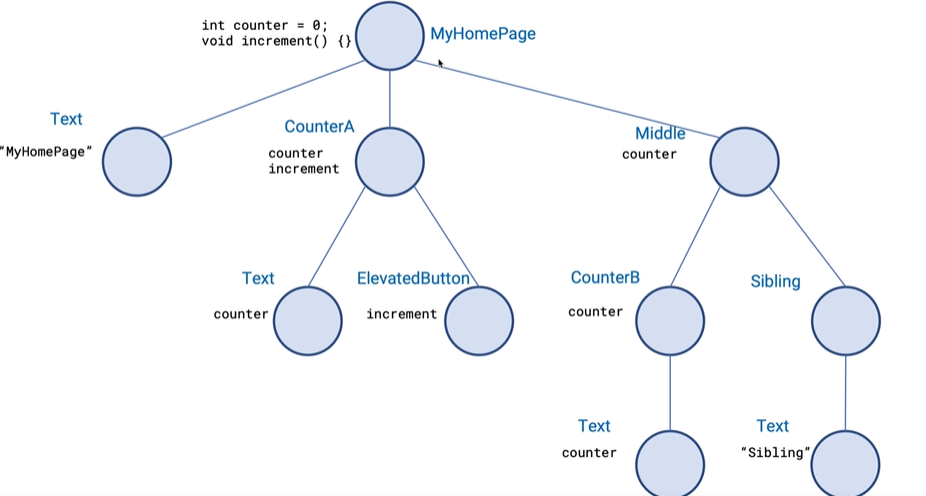

* 앱 트리
 - 
* main01 
  - ui 설명
  - [소스](main01.dart)
* main02 
  - 생성자로 counter와 increment 함수 전달
  - [소스](main02.dart)
* main03 
  - provider 적용
  - [소스](main03.dart)
* main04 
  - CounterB 위젯에 SiblingText 추가
  - 위젯 리빌드 확인
  - [소스](main04.dart)
* main05
  - consumer 적용
  - [소스](main05.dart)
* main06
  - model에 필드 추가
  - [소스](main06.dart)
* main07
  - selector 적용
  - [소스](main07.dart)