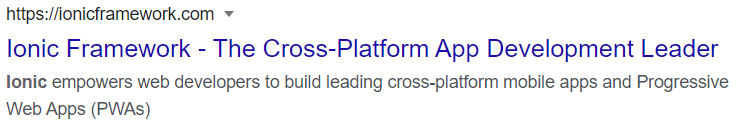
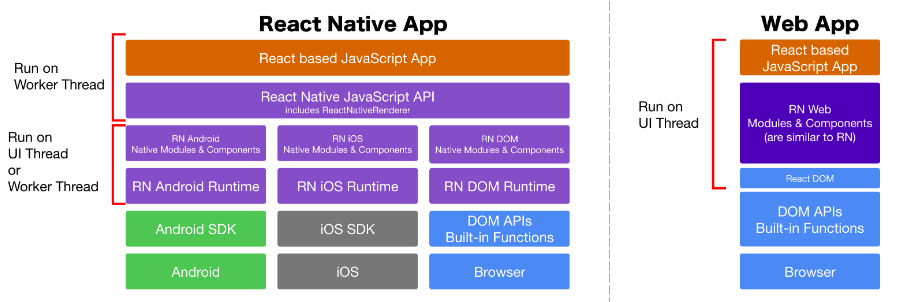
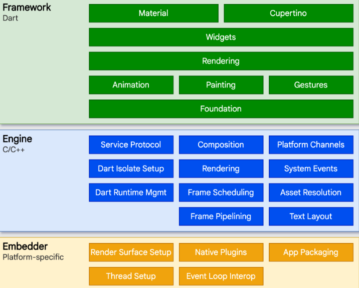
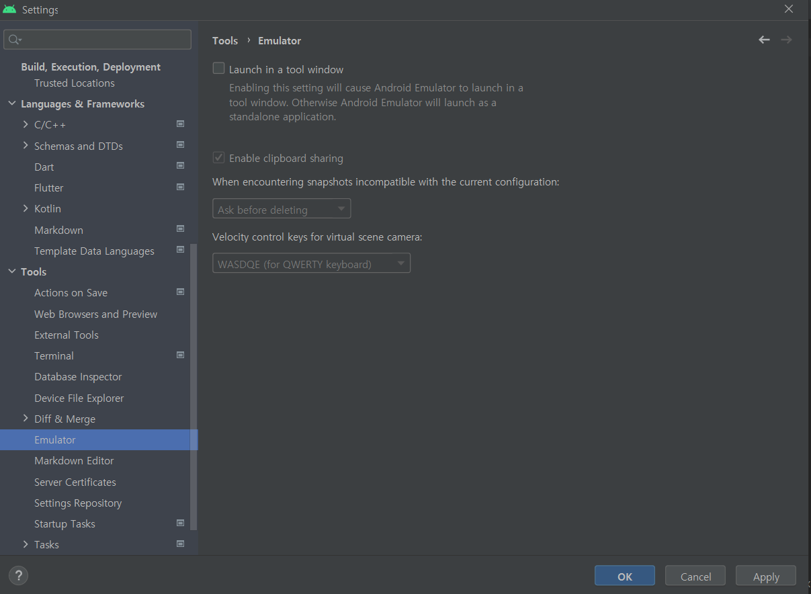
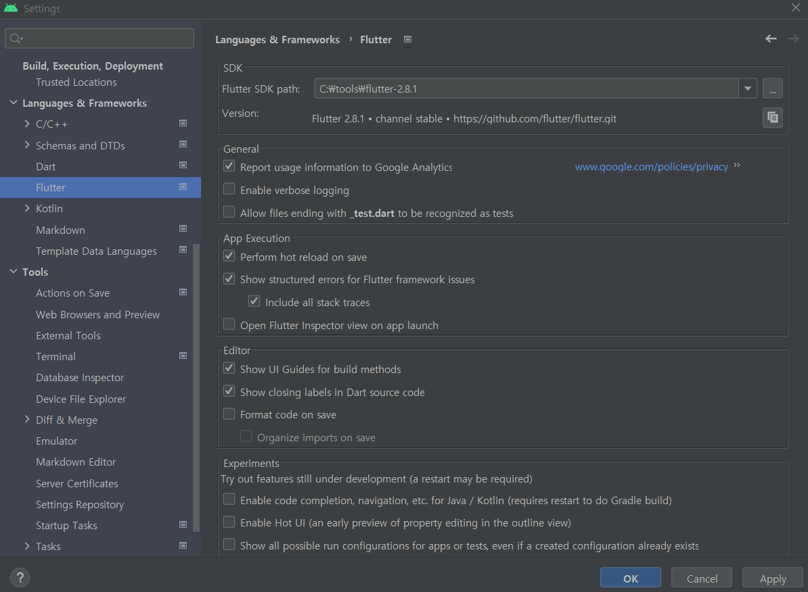

# 01 플러터 시작하기
## 01-1 플러터의 등장 배경
  - 2007년 아이폰 등장
    - Objective-C -> Swift
  - 2008년 안드로이드 운영체제 발표
    - Java -> Kotlin
  - 웹앱의 등장
    - 웹 기술을 이용해서 만든 앱
    - 프로그래시브 웹앱(Progressive web apps, PWA)
      - 오프라인에서도 동작
    - 하이브리드 앱
      - 웹앱을 만든 후 프레임워크를 이용해 운영체제별로 동작하는 앱을 만드는 기술
        
  - 리액트 네이티브와 플러터
    - 크로스 플랫폼 앱 개발 프레임워크
    - 리액트 네이티브
      - 메타
      - 2015년 출시
      - 언어 : 자바스크립트(리액트)
      - 장점 : 자바스크립트 생태계
      - 단점 : 네이티브 연결이 어려움
      - showcase
        - https://reactnative.dev/showcase
      - architecture
        - 
    - 플러터
      - 구글
      - 2017년 출시
      - 언어 : 다트
      - 장점 : 다양한 위젯, 네이티브 하드웨어와의 연결성
      - 단점 : 앱 크기가 큼(네이티브 대비), 빠른 업데이트 주기(https://docs.flutter.dev/development/tools/sdk/releases)
      - showcase
        - https://flutter.dev/showcase
      - architecture
        - 
## 01-2 플러터가 주목받는 이유
  - 높은 개발 효율
    - 다양한 운영체제에서 동일한 ux 제공
    - 핫 리로드 기능
  - 유연한 사용자 인터페이스
    - 다양한 위젯 제공
      - 머티리얼, 쿠퍼티노 디자인 지원
    - 강력한 애니메이션 기능 제공
  - 빠른 속도
    - 스키아 엔진 이용
  - 웹, 데스크톱 앱 개발 지원
## 01-3 개발 환경 준비하기
  - 안드로이드 스튜디오 설치
    - 플러터 플로그인 설치
  - 플러터 SDK 설치
    ```
                    book   installed  current
    sdk version    2.2.3     2.8.1     3.3.7
    dart version   2.13.4   2.15.1    2.18.4
    ```
## 01-4 플러터 프로젝트 시작하기
  - 에뮬레이터 설정
    
  - 플러터 SDK 설정
    