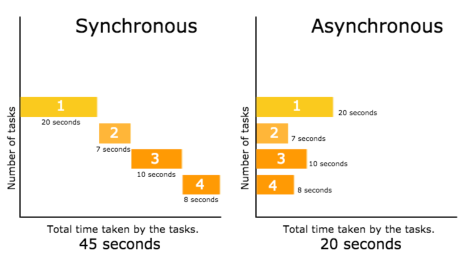

# 02 다트를 알면 플러터가 보인다
  - 간단하게 배워서 다양한 플랫폼에 써먹자!
## 02-1 카멜레온 같은 언어, 다트!
  - 다트 언어의 9가지 특징
    - main()함수로 시작
    - 어디에서나 변수 선언, 사용 가능
    - 모든 변수는 객체
    - 자료형이 엄격한 언어
    - 제네릭 타입 제공
    - 외부 노출 지시자가 없음(_로 제어)
    - 변수와 함수는 _와 문자열로 시작
    - 삼항연산자 제공
      ```
      var visibility = isPublic ? 'public' : 'private';
      String playName(string name) => name ?? 'Guest';
      ```
  - Null safety 지원
    - 2.12.0 버전부터 지원
## 02-2 비동기 처리 방식 알아보기
  - 비동기(asynchronous)란
    - 작업을 기다리지 않고 다음 작업을 처리
    - 
  - 비동기 프로세스의 작동 방식
    - async와 await 키워드를 이용
    ``` 
    void main() {
      getVersionName().then((value) => {
        print(value)
      });
      print('end process');
    }
    
    Future<String> getVersionName() async{
      return await lookUpVersionName();
    }
    
    String lookUpVersionName(){
      return "Android Q";
    }
    ```
## 02-3 JSON 데이터 주고 받기
  - JSON 디코드/인코드
    - convert 라이브러리의 jsonDecode, jsonEncode 이용
## 02-4 스트림 통신하기
  - 요점(https://dart.dev/tutorials/language/streams)
    - 스트림은 데이터의 비동기 시퀀스를 제공
    - 데이터 시퀀스에는 사용자 생성 이벤트와 파일에서 읽은 데이터 포함
    - Stream API로부터 await for나 listen()을 사용해 스트림을 처리
    - 스트림은 오류에 응답하는 방법을 제공
    - single subscription과 브로드캐스트, 2종류의 스트림이 있음
  - async*와 yield 키워드
    ``` 
    Future<int> sumStream(Stream<int> stream) async {
      var sum = 0;
      await for (var value in stream) {
        print('sumStream : $value');
        sum += value;
      }
      return sum;
    }
    
    Stream<int> countStream(int to) async* {
      for (int i = 1; i <= to; i++) {
        print('countStream : $i');
        yield i;
      }
    }
    
    main() async {
      var stream = countStream(10);
      var sum = await sumStream(stream);
      print(sum); // 55
    }
    ```
  - then()을 활용
    ``` 
    main() async {
      var stream = Stream.fromIterable([1,2,3,4,5]);
      stream.first.then((value) => print("first: $value"));
    }
    ```
## 02-5 도전! 다트 프로그램 만들기
  - [구구단 프로그램](../Chapter2/53p_gugudan.dart)
  - [자동차 클래스](../Chapter2/54p_car.dart)
    - https://dart.dev/guides/language/language-tour#constructors
  - [로또 번호 생성기](../Chapter2/56p_lottery.dart)